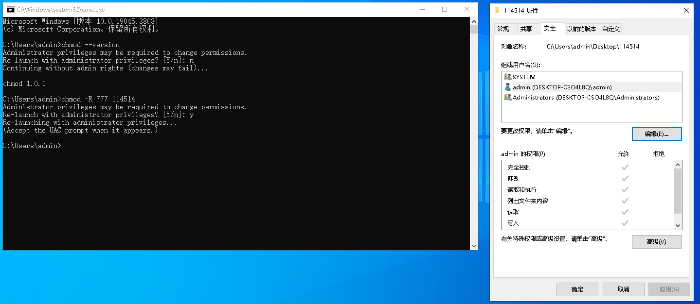

# Windows chmod

> 一款帮助linux用户熟悉windows更改权限的工具，修复了windows使用chmod命令时显示：'chmod' 不是内部或外部命令，也不是可运行的程序
或批处理文件。的bug，使用python编写。

## 使用截图

## 功能特性

- **数字模式**: `chmod 755 file` / `chmod 4755 file`
- **符号模式**: `chmod u+x,g-w,o=rx file` / `chmod a=r file`
- **特殊权限位**: setuid (4000), setgid (2000), sticky (1000) 解析（含警告提示）
- **递归操作**: `chmod -R 755 directory/`
- **详细输出**: `chmod -v 644 *.txt`
- **仅显示变更**: `chmod -c u+x file`
- **静默模式**: `chmod -f 000 file`
- **参考文件**: `chmod --reference=ref.txt target.txt`
- **保护根目录**: `--preserve-root` / `--no-preserve-root`
- **管理员权限自动检测**: 非管理员运行时自动提示以管理员身份重新运行

## 权限映射

| Unix 类别 | Windows 账户 | 说明 |
|-----------|-------------|------|
| u (owner) | 文件实际所有者 | 通过 PowerShell `(Get-Acl).Owner` 获取 |
| g (group) | `BUILTIN\Users` | 所有本地用户 |
| o (others) | `Everyone` | 所有人 |

| Unix 权限 | icacls 权限 | 说明 |
|-----------|------------|------|
| r (read) | (R) | 读取 |
| w (write) | (W) | 写入 |
| x (execute) | (X) | 执行/遍历 |
| rwx | (R,W,X) | 读写执行 |
| M (modify) | RWX + Delete | 修改（含删除） |
| F (full) | 完全控制 | 完全控制权限 |

## 安装

### 方法 1：一键安装（推荐）

1. 双击运行 `install目录下的install.bat`
2. 重新打开终端，直接使用 `chmod` 命令

```bash
# 安装之后，任何位置都能用
chmod --version
chmod -v 755 file.txt
chmod -R 644 project/
```

### 方法 2：直接 Python 运行（开发使用）

```bash
python run_chmod.py 755 file.txt
python run_chmod.py -v 644 file.txt
```

## 操作示例

### 数字模式

```bash
chmod 755 file.txt          # rwxr-xr-x
chmod 644 file.txt          # rw-r--r--
chmod 600 file.txt          # rw-------
chmod 777 file.txt          # rwxrwxrwx
chmod 000 file.txt          # ---------
chmod 4755 file.txt         # setuid + rwxr-xr-x
chmod 1777 directory/       # sticky + rwxrwxrwt
```

### 符号模式

```bash
chmod u+x file.txt          # 给所有者添加执行权限
chmod g-w file.txt          # 移除组写权限
chmod o=rx file.txt         # 设置其他人权限为 r-x
chmod a+r file.txt          # 所有人添加读权限
chmod u+r,g+w,o+x file.txt  # 多个操作
chmod a= file.txt           # 清除所有权限
chmod +x script.py          # 等同于 a+x
chmod u+s program.exe       # 设置 setuid
chmod g+s directory/        # 设置 setgid
chmod +t directory/         # 设置 sticky bit
chmod a+X directory/        # 递归时只给目录加执行权限
```

### 递归操作

```bash
chmod -R 755 directory/           # 递归设置 755
chmod -R a+X directory/           # 递归给目录加执行权限（不改文件）
chmod -R u=rw,go=r directory/     # 递归设置 644
```

### 详细输出

```bash
chmod -v 755 file.txt
# 输出: mode of 'file.txt' changed from 0644 (rw-r--r--) to 0755 (rwxr-xr-x)

chmod -c u+x *.sh
# 只显示有变更的文件
```

## 选项

| 选项 | 说明 |
|------|------|
| `-R, --recursive` | 递归修改文件和目录 |
| `-v, --verbose` | 为每个处理的文件输出诊断信息 |
| `-c, --changes` | 类似 verbose，但仅在有变更时报告 |
| `-f, --silent, --quiet` | 抑制大多数错误消息 |
| `--reference=RFILE` | 使用 RFILE 的权限模式代替 MODE |
| `--preserve-root` | 禁止对根目录递归操作 |
| `--no-preserve-root` | 不特殊处理根目录（默认） |
| `--version` | 显示版本信息 |
| `--help` | 显示帮助信息 |

## 管理员权限自动检测

`chmod` 在启动时自动检测是否以管理员身份运行：

- **已有管理员权限**：正常执行，不显示任何提示。
- **无管理员权限（交互模式）**：显示横幅警告，询问是否以管理员身份重新启动。选择 `Y`（默认）则通过 UAC 提权重启；选择 `n` 则继续以普通权限执行。
- **无管理员权限（非交互模式，如管道/重定向）**：显示警告但自动继续执行，不阻塞自动化脚本。

## 注意事项

1. **管理员权限**：修改文件权限通常需要管理员权限。chmod 会自动检测并提示提权。
2. **特殊权限位**：setuid、setgid 和 sticky 位在 Windows 上没有直接等价物。设置时会解析并显示警告。
3. **保留 ACE**：工具不会修改 `BUILTIN\Administrators` 和 `NT AUTHORITY\SYSTEM` 的权限，确保系统安全性。
4. **只读属性**：当移除所有者的写权限时，还会设置 Windows 只读属性作为额外保护。
5. **PowerShell 依赖**：获取文件所有者和提权需要 PowerShell（Windows 内置）。

## 技术实现

- 使用 `icacls` 命令读写 Windows ACL
- 使用 PowerShell `(Get-Acl).Owner` 获取文件所有者
- 使用 `ctypes.windll.shell32.IsUserAnAdmin()` 检测管理员权限
- 使用 PowerShell `Start-Process -Verb RunAs` 实现 UAC 提权
- 解析 icacls 输出，将 Windows 权限转换为 Unix rwx 格式
- 支持符号模式解析（符合 POSIX chmod 规范）
- 无需外部 Python 依赖

## 许可证

MIT License
